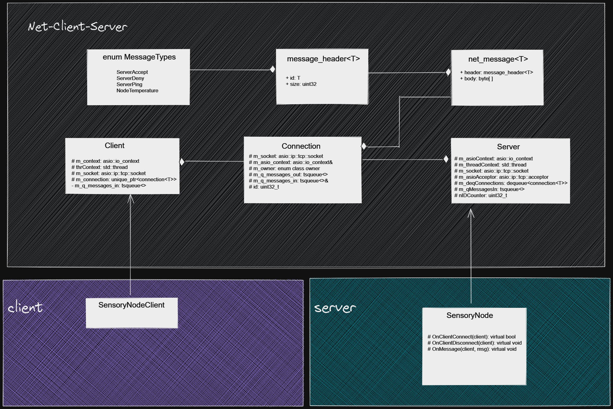

## Forest fire forecasting

This is a client-server networking application using standalone Asio c++ library.

## Build and Run

This application is containerized. Just build the Docker image and run the
Docker Compose.

### Prerequisites:
- Docker
- Docker compose.

### Steps
1. Copy the `.env.example` and name the copied file `.env`. Leave out the defaults.
2. Open 2 terminal tabs, in the first `cd server` and in the second `cd client`.
3. Build the server: `docker-compose build server`.
4. Build the client: `docker-compose build client`.
5. Run the server: `docker-compose up server`.
6. Run the client: `docker-compose up client`. You can scale the clients as many as
    you want. Ex. `docker-compose up --scale client=5 client`.

### Run Tests

Before running the below command, make sure that you build the client docker service
as mentioned in the previous section point No. 4

1. From the client directory, run: `docker-compose -f docker-compose.yml -f docker-compose.test.yml up test`.

## System Design

## Class Diagram

